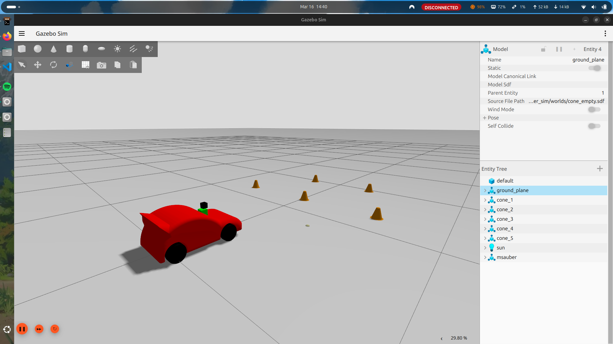
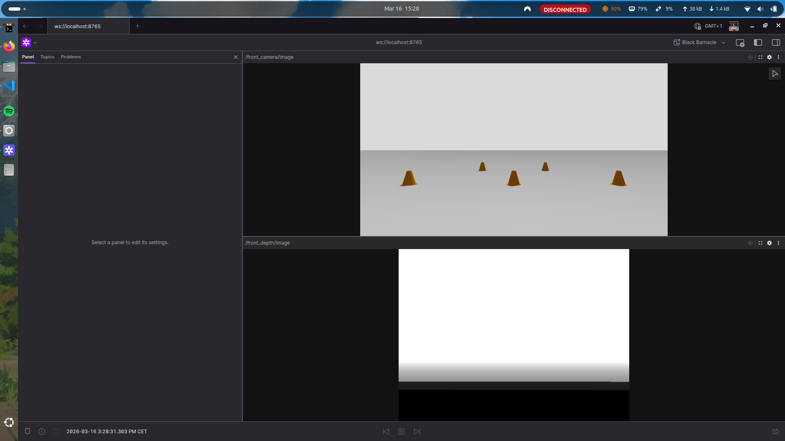
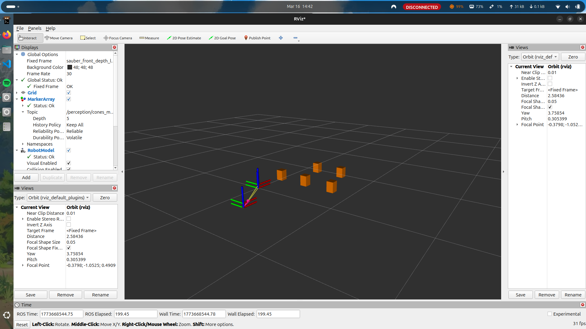

# msauber stack


MSAUBER is a ROS 2 Jazzy workspace for simulation, control, navigation, and perception of a small Formula Student style vehicle.

# Table of contents

[Packages](#packages)

[Docker workflow](#docker-workflow)

[Launch](#launch)

[Development notes](#development-notes)

[Perception](#perception)

[Useful commands](#useful-commands)

[Foxglove](#foxglove)

---

# Packages

## msauber_description

Contains the robot model and related assets:
- URDF / Xacro
- meshes
- RViz configuration

## msauber_control

Contains the control layer:
- ros2_control configuration
- Ackermann controller setup
- teleop bridge

## msauber_sim

Contains simulation resources:
- Gazebo launch files
- world files
- custom models
- GUI plugin integration

## msauber_navigation

Contains the navigation stack:
- TF / odom bridge
- planner integration
- MPC follower

## msauber_perception

Contains the perception stack:
- YOLO integration
- cone detection node
- model files

## msauber_bringup

Top-level launch package used to start the complete stack.

---

# Docker workflow

The recommended way to run this project is with Docker.

## Prerequisites

Host requirements:
- Docker
- Docker Compose
- X11 available on the host for Gazebo GUI

If you are on Linux and Gazebo cannot open a window, allow local Docker containers to access your X server:

```bash
xhost +local:docker
```

## Build the image

From the repository root:

```bash
docker compose build --no-cache msauber
```

The image installs:
- ROS 2 Jazzy
- Gazebo / ros_gz integration
- Nav2 packages used by the stack
- Poetry dependencies from `pyproject.toml`
- the workspace itself with `colcon build`

## Start the container

```bash
docker compose up msauber
```

Or, in detached mode:

```bash
docker compose up -d msauber
```

To open a shell inside the running container:

```bash
docker exec -it msauber bash
```

The container shell automatically sources:
- `/opt/ros/jazzy/setup.bash`
- `/ros2_ws/.venv/bin/activate`
- `/ros2_ws/install/setup.bash`

## Workspace layout inside the container

Inside the container the workspace is mounted at:

```bash
/ros2_ws
```

The following volumes are persisted:
- `build/`
- `install/`
- `log/`

The `src/` folder is bind-mounted from the host, so source edits on your machine are immediately visible inside the container.

## Rebuild after source changes

If you change ROS packages in `src/`, rebuild inside the container:

```bash
colcon build --symlink-install
```

If you change:
- `Dockerfile`
- `docker-compose.yml`
- `pyproject.toml`
- `poetry.lock`

you should rebuild the image:

```bash
docker compose build --no-cache msauber
```

---

# Launch

To start the full simulation stack inside the container:

```bash
ros2 launch msauber_bringup sim_bringup.launch.py
```

## Common launch examples

Robot description in RViz:

```bash
ros2 launch msauber_description description.launch.py use_rviz:=true
```

Gazebo with a custom world:

```bash
ros2 launch msauber_sim sim.launch.py world:=cone_empty
```

Perception stack:

```bash
ros2 launch msauber_perception perception.launch.py
```

Navigation-enabled bringup:

```bash
ros2 launch msauber_bringup sim_bringup.launch.py use_nav2:=true
```

Choose a world:

```bash
ros2 launch msauber_bringup sim_bringup.launch.py world:=pista
```

Available worlds:
- `my_empty`
- `cone_empty`
- `pista`
- `sonoma`

Disable sensors:

```bash
ros2 launch msauber_bringup sim_bringup.launch.py enable_sensors:=false
```

Enable Foxglove bridge:

```bash
ros2 launch msauber_bringup sim_bringup.launch.py use_foxglove:=true
```

---

# Development notes

## Build manually inside the container

```bash
colcon build --symlink-install
```

## Clean persistent build artifacts

If you want to reset the workspace build state managed by Docker volumes:

```bash
docker compose down -v
```

Then rebuild and start again:

```bash
docker compose build --no-cache msauber
docker compose up msauber
```

## Controller notes

The stack uses an Ackermann controller. For manual control, you can publish teleop commands from another shell in the container.

Example:

```bash
ros2 run teleop_twist_keyboard teleop_twist_keyboard
```

On many keyboards the bindings are easier to use with the terminal focused directly on the teleop node.

---

# Perception

The perception stack uses a YOLO model trained for cone detection.

A convenient world for testing perception is:

```bash
ros2 launch msauber_bringup sim_bringup.launch.py world:=cone_empty use_yolo:=true
```

Camera topics:
- `/front_camera/image`
- `/front_camera/camera_info`
- `/front_depth/image`
- `/front_depth/camera_info`

The cone detection pipeline publishes markers that can be visualized in RViz.







---

# Useful commands

Open RViz:

```bash
rviz2
```

Kill Gazebo if needed:

```bash
pkill -9 -f 'gz-sim|gz sim|gz'
```

Stop the running container:

```bash
docker compose down
```

Show container logs:

```bash
docker compose logs -f msauber
```

---

# Foxglove

Foxglove can connect to the bridge started by the bringup launch file.

Enable it with:

```bash
ros2 launch msauber_bringup sim_bringup.launch.py use_foxglove:=true
```

Connection info:
- address: `ws://localhost`
- port: `8765`
