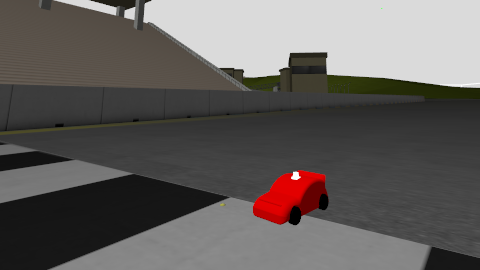

# msauber


 


## Table of content
[Installation](#install)

[Build](#build)

[Launch](#launch)

[Controller](#controller)

[Usefull commands](#commands)

[Foxglove](#foxglove)

## Installation
[ROS2 Jazzy installation guide](https://docs.ros.org/en/jazzy/Installation/Ubuntu-Install-Debs.html)

[Gazebo Harmonic 8.9 installation guide](https://gazebosim.org/docs/harmonic/install_ubuntu/)

### Package installation
First of all you need to create your ROS2 workspace (usually named dev_ws).
Inside of the workspace a directory named src has to be created and here you'll have all you packages.

For our case you can clone the main branch of this repository in ~/dev_ws/src/ using:

 ```bash
git clone https://github.com/sjckness/msauber.git
```
## Build
inside /dev_ws use the following command to build the package (this step is mandatory every time you open a new terminal): 
```bash
colcon build --simlink-install --package-select msauber
```
Then you have to source the workspace, and now ros knows where your files are. Use:
```bash
source install/setup.bash
```
## Launch
```bash 
ros2 launch msauber msauber.launch.py
```
## Controller
### Easy controller 
To activate the easy keyboard controller, after the simulation is started and the robot is spawned, open a new terminal in ~/dev_ws and use:

```bash 
ros2 run msauber keyboard_driver
```
Then you can use WASD for moving the car. You have to select the terminal where you launch th econtroller when you press the WASD keys 
otherwise it doesn't work.
Next step is to directly add the commands in gazebo...

### Ackerman controller
The ackerman controller is a ROS2 type of controller that allowes you to choose velocity and stering angle. In this version is used with the node [teleop_twist_keyboard] from the namesake package. It take imput from the keyboard and the car moves.

To use it just run:
```bash 
ros2 run teleop_twist_keyboard teleop_twist_keyboard
```
It works better with US keyboards, istead of WASD you should use IJML.


## worlds
In order to try different worlds is now possible to select it when launching the simulation by setting the 'world' parameter:
```bash
ros2 launch msauber msauber.launch.py world:=world_name
```
Worlds available in the package kumi:
- my_empty 
- sonoma (alpha)

## Cameras
Cameras are implemented for navigation. One classic front camera and one depth camera. 
To visualize the cameras outputs we need to use [Foxglove](#foxglove).

You should add an IMAGE pannel and set, for the classic camera:
- topic : /front_camera/image
- calibration : /front_camera/camera_info

And for the depth camera:
- topic : /front_depth/image
- calibration : /front_depth/camera_info

Is possible to disable the sensors by passign the following argument to false while launching:
```bash
ros2 launch msauber msauber.launch.py woenable_sensorsrld:=false
```


## Commands
to kill gazebo:
```bash
pkill -9 -f 'gz-sim|gz sim|gz'
```
## Foxglove
Foxglove is a visualization and debugging tool for robotics that allows you to inspect, analyze, and replay ROS data (topics, messages, and logs) in real time or from recorded bag files.

In a new terminal:
```bash
foxglove-studio
```
Foxglove session info:
 - address: ws://localhost
 - port: 8765 (defined in launch file)